# liri-app

Liri is a simple Node command line app that takes user input and searches specific APIs.

- - -
## Installation
* Using the command line, cd into the directory, and run ```npm install```
* Create a ```.env``` file in the direcory with the following contents:
```js
# Spotify API keys

SPOTIFY_ID=your-spotify-id
SPOTIFY_SECRET=your-spotify-secret
```

- - -
## Commands
### concert-this
Liri takes the name of a band/artist, and using the Bands In Town API, prints where and when that artist will next be performing.

If no search term is entered, liri will not search.

```node liri.js concert-this "band or artist name"'```

### spotify-this-song
Liri takes the name of a song, and using the spotify search package, prints the following information about each result:
* Artist(s)

 * The song's name

 * A preview link of the song from Spotify

 * The album that the song is from

 If no search term is entered, liri will search for "The Sign Ace of Base" by default.

 ```node liri.js spotify-this-song "song title"```

### movie-this
Liri takes the name of a movie, and using the OMDB API, prints the following information about the result:
* Title of the movie.
* Year the movie came out.
* Various ratings of the movie
* Country where the movie was produced.
* Language of the movie.
* Plot of the movie.
* Actors in the movie.

If no search term is entered, liri will search for "Mr. Nobody" by deault.

```node liri.js movie-this "movie title"```

### do-what-it-says
Liri reads the random.txt file, and follows what is written in the file. By default, random.txt reads the following: 
```spotify-this-song,"I Want it That Way"```
Therefore, by default, this command will run the spotify search on "I Want it That Way"

```node liri.js do-what-it-says```

### help
Liri prints a shortened version of the instructions.

```node liri.js help```

### invalid command
If you don't enter a valid command, liri will inorm you as such, and direct you to check either the readme or the help command.

- - -
## Examples
### concert-this
#### No Input
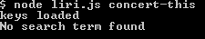
#### Input With Results
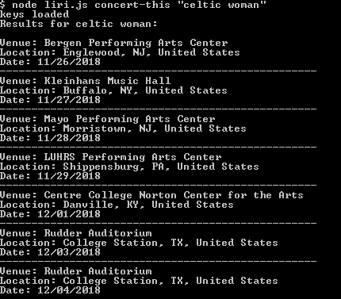
#### Input Without Results
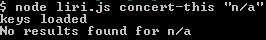

### spotify-this-song
#### No Input
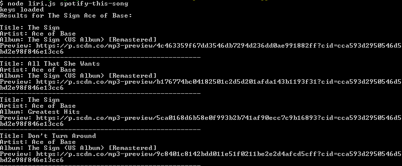
#### Input With Results
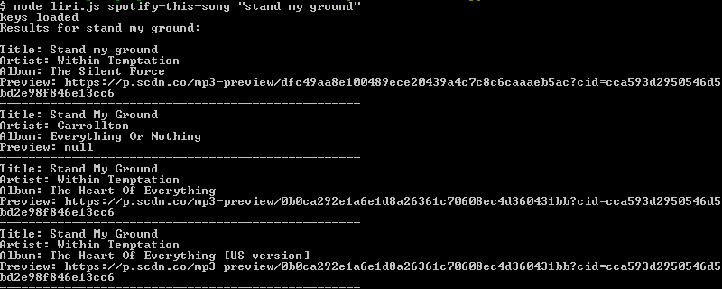
#### Input Without Results
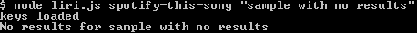

### movie-this
#### No Input
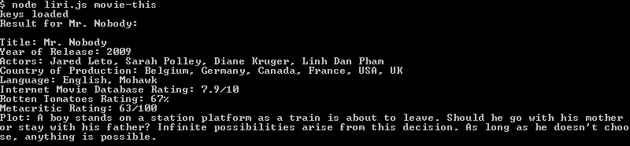
#### Input With Results
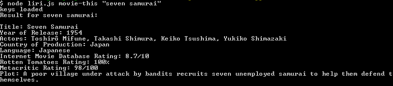
#### Input Without Results
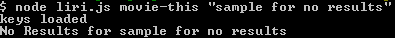

### do-what-it-says
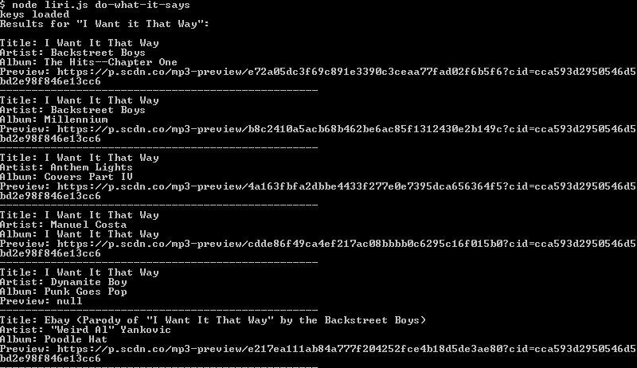

### help
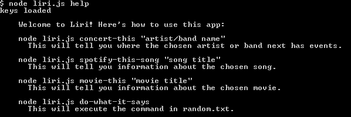

### invalid command
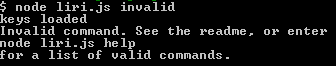

- - -
## Built WIth
   * [Node-Spotify-API](https://www.npmjs.com/package/node-spotify-api)

   * [Request](https://www.npmjs.com/package/request)

   * [OMDB API](http://www.omdbapi.com)
   
   * [Bands In Town API](http://www.artists.bandsintown.com/bandsintown-api)

   * [Moment](https://www.npmjs.com/package/moment)

   * [DotEnv](https://www.npmjs.com/package/dotenv)
   